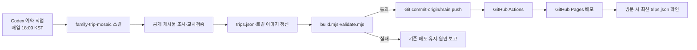

# 아빠 어디가~

공개 인스타그램의 가족여행·어린이 체험·나들이 게시물을 조사하고, 확인 가능한 반응 수치를 기준으로 모자이크 카드에 보여주는 AI 실습 프로젝트입니다.

- 공개 사이트: <https://dahanpark.github.io/newscard/>
- 저장소: <https://github.com/dahanpark/newscard>
- 자동 조사·배포: 매일 18:00 KST
- 정렬 기준: `좋아요 + 댓글 × 5`
- 주의: 인스타그램 전체 순위가 아니라 조사한 공개 표본 안의 순위입니다.

## AI 실습 목표

이 프로젝트는 단순한 HTML 제작보다 다음 과정을 반복 가능하게 만드는 데 목적이 있습니다.

1. AI가 공식 관광 계정과 개인 여행·육아 인플루언서의 공개 게시물을 조사합니다.
2. 게시일, 확인시각, 좋아요, 댓글, 광고·협찬, 종료·예약·안전정보를 기록합니다.
3. 공개 반응점수를 계산하고 가족 나들이 적합성을 검토합니다.
4. 두 줄 이내의 짧은 제목과 요약으로 카드 데이터를 편집합니다.
5. 정적 HTML을 생성하고 데이터·접근성·반응형 화면을 검증합니다.
6. 모든 품질 기준을 통과한 경우에만 GitHub에 커밋하고 Pages에 배포합니다.
7. 방문자의 브라우저는 페이지를 열 때마다 최신 배포 데이터를 다시 확인합니다.

자세한 학습 구조와 자동화 프롬프트는 [AI 실습 설명서](docs/AI-PRACTICE.md)를 참고하세요.

## 전체 동작 구조



Codex 예약 작업은 새 자료를 조사하고 파일을 수정합니다. GitHub Actions는 `main`에 들어온 결과를 다시 빌드·검증한 뒤 Pages에 배포합니다. 두 자동화의 역할은 서로 다릅니다.

## 매일 오후 6시 자동 갱신

Codex 예약 작업 `매일 아빠 어디가 갱신·배포`가 다음 조건으로 활성화되어 있습니다.

| 항목 | 설정 |
|---|---|
| 상태 | `ACTIVE` |
| 시각 | 매일 18:00, `Asia/Seoul` |
| 실행 위치 | 이 로컬 Git 저장소 |
| 작업 기준 | `family-trip-mosaic/SKILL.md`, `AGENTS.md` |
| 성공 조건 | 빌드·검증 통과 및 8개 역할 각각 9.5 이상 |
| 성공 결과 | 관련 파일 커밋, `origin/main` push, Pages 확인 |
| 실패 결과 | 기존 배포 유지, 실패 원인 보고 |

로컬 프로젝트를 사용하는 예약 작업이므로 예정 시각에 다음 조건이 필요합니다.

- 컴퓨터가 켜져 있어야 합니다.
- Codex 데스크톱 앱이 실행 중이어야 합니다.
- 저장소와 인터넷에 접근할 수 있어야 합니다.
- GitHub push 권한이 유효해야 합니다.
- 사용자 작업과 충돌하는 미완료 변경이 없어야 합니다.

공식 OpenAI 문서: [Scheduled tasks](https://learn.chatgpt.com/docs/automations)

## 조사 및 선정 기준

매일 갱신은 다음 목표 표본을 조사합니다.

- 공식 관광 계정 3개 이상
- 고유 개인 계정 12개 이상
- 개인 여행 전문 계정 5개 이상
- 육아·아이동반 계정 5개 이상
- 서울·경기·인천 지역 전문 계정 4개 이상
- 최근 30일 전국 후보 90개 이상
- 최근 30일 서울·근교 후보 90개 이상

30일 자료만으로 기준을 채우지 못할 때만 60일까지 확장하고 그 사실을 화면에 공개합니다. 로그인 없이 열리는 공개 원문만 사용하며, 광고·협찬·초대 표시를 지우지 않습니다.

목표 결과는 서로 중복되지 않는 `전국 30선`과 `서울·근교 30선`입니다. 현재 배포본은 기존 단일 목록 30개와 서울·근교 필터를 사용하고 있으며, 다음 완전한 콘텐츠 갱신에서 두 독립 목록으로 이전해야 합니다.

## 8개 역할 품질 검토

평균이 아니라 다음 역할 각각이 10점 만점에 9.5점 이상이어야 배포할 수 있습니다.

| 역할 | 검토 내용 |
|---|---|
| 화이트 | 최신성, 조사 범위, 출처 추적 가능성 |
| 블랙 | 카드 구조, 짧은 문구, 메시지 명료성 |
| 레드 | 사실·수치·링크 교차검증과 과장 방지 |
| 골드 | 일반 독자의 이해도와 행동 명확성 |
| 블루 | 검증된 근거 안의 설득력과 반론 대응 |
| 실버 | 여행·육아·현장 운영 관점의 타당성 |
| 퍼플 | 모자이크 위계, 대비, 작은 화면 가독성 |
| 퍼플2 | 전체 완성도와 즉시 배포 가능성 |

## GitHub에서 `index.html` 실행하기

GitHub 저장소의 `index.html` 파일을 클릭하면 **코드만 표시되며 웹사이트처럼 실행되지 않습니다.** GitHub는 저장소 파일 화면에서 HTML 실행을 차단하기 때문입니다.

이 프로젝트는 GitHub Pages로 실행합니다.

1. 브라우저에서 <https://dahanpark.github.io/newscard/>를 엽니다.
2. 강제 최신 확인이 필요하면 주소 끝에 임의의 쿼리를 붙입니다. 예: `?v=20261004`
3. 화면의 `최신 자료 불러옴` 표시를 확인합니다.
4. 필요하면 `새 정보 확인` 버튼을 누릅니다.

본인 저장소에서 처음 설정할 때는 GitHub의 `Settings → Pages → Build and deployment → Source`를 **GitHub Actions**로 선택합니다. 이후 `main`에 push하면 `.github/workflows/deploy-pages.yml`이 자동으로 실행됩니다.

## 페이지를 열 때 일어나는 일

1. `index.html`에 포함된 검증된 정적 카드 30개를 즉시 표시합니다.
2. `app.js`가 캐시를 우회한 `trips.json` 요청을 보냅니다.
3. 카드 수, 순위, 반응점수, 원문 주소와 이미지 경로를 브라우저에서 다시 검사합니다.
4. 검사를 통과하면 카드·조사방법·확인시각을 최신 데이터로 교체합니다.
5. 요청이나 검증이 실패하면 정적 카드를 그대로 유지합니다.

이 기능은 GitHub에 게시된 최신 데이터를 받는 기능입니다. 방문자의 브라우저가 인스타그램을 실시간으로 수집하거나 새로운 사실을 생성하지 않습니다.

## 로컬에서 실행하기

저장소를 복제하거나 내려받은 뒤 프로젝트 폴더에서 실행합니다.

```powershell
node scripts/serve.mjs
```

브라우저에서 <http://127.0.0.1:8765>를 엽니다. `file://`로 `index.html`을 직접 열면 브라우저 보안 정책 때문에 `trips.json` 요청이 제한될 수 있으므로 미리보기 서버 사용을 권장합니다.

데이터를 수정한 뒤에는 다음 순서로 확인합니다.

```powershell
node scripts/build.mjs
node scripts/validate.mjs
git diff --check
```

`build.mjs`는 `trips.json`을 `index.html`의 정적 카드로 기록합니다. 따라서 JavaScript가 꺼지거나 네트워크 요청이 실패해도 모자이크와 원문 링크가 남습니다.

## GitHub에 수동 배포하기

검증을 통과한 뒤 변경 파일을 커밋하고 `main`에 push합니다.

```powershell
git add README.md docs family-trip-mosaic index.html app.js styles.css trips.json scripts
git commit -m "Update family trip mosaic"
git push origin main
```

push 뒤에는 GitHub 저장소의 `Actions` 탭에서 `Validate and deploy family trip mosaic` 실행이 성공했는지 확인하고, Pages 주소에서 실제 화면을 다시 확인합니다.

## 주요 파일

| 파일 | 역할 |
|---|---|
| `family-trip-mosaic/SKILL.md` | AI 조사·편집·검증·배포 절차 |
| `AGENTS.md` | 8개 역할과 9.5점 품질 기준 |
| `trips.json` | 조사 시각, 방법, 점수와 카드 원본 데이터 |
| `scripts/build.mjs` | JSON을 정적 카드 HTML로 변환 |
| `scripts/validate.mjs` | 데이터·이미지·역할 점수·갱신 기능 검사 |
| `index.html` | 정적 대체 콘텐츠가 포함된 배포 페이지 |
| `app.js` | 최신 JSON 확인, 카드 교체, 필터 기능 |
| `styles.css` | 데스크톱·태블릿·모바일 모자이크 디자인 |
| `.github/workflows/deploy-pages.yml` | push 후 GitHub Pages 검증·배포 |
| `docs/AI-PRACTICE.md` | 과제용 AI 자동화 설계 설명 |

## 한계와 안전장치

- 인스타그램 로그인 벽, 비공개 계정, CAPTCHA는 우회하지 않습니다.
- 공개 반응 수치가 없는 게시물을 임의 숫자로 환산하지 않습니다.
- 일정·요금·예약·안전정보는 방문 전 공식 채널에서 다시 확인해야 합니다.
- 예약 실행이 실패해도 기존 정상 배포를 삭제하거나 빈 페이지로 교체하지 않습니다.
- 컴퓨터나 Codex 앱이 꺼져 있으면 로컬 예약 작업이 실행되지 않을 수 있습니다.
- GitHub Pages는 정적 호스팅이므로 자체적으로 AI 조사를 수행하지 않습니다.
